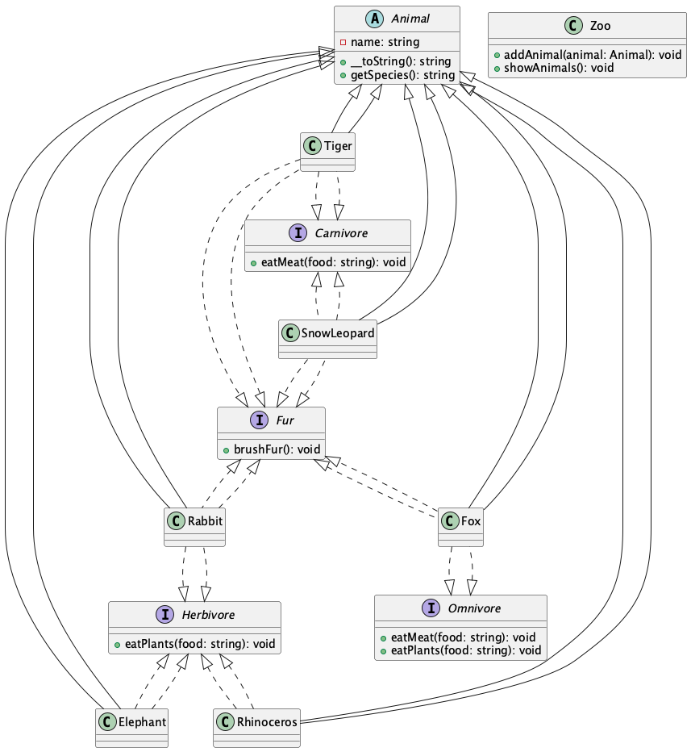

# Zadanie 1 — Wirtualne ZOO (PHP)

## Opis (Polski)

System klas wirtualnego ZOO obejmuje:
- Zwierzęta różnych gatunków (tygrys, słoń, nosorożec, lis, irbis śnieżny, królik)
- Podział na mięsożerne, roślinożerne, wszystkożerne
- Obsługę posiłków i czesania futra
- Możliwość umieszczania zwierząt w ZOO

### Diagram klas (UML)



### Diagram stanu (UML)


### Diagram przypadków użycia (Use Case)


### Diagram klas (tekstowy UML)

```
+----------------+
|   Animal       |<--(abstract)
+----------------+
| - name         |
+----------------+
| +__toString()  |
| +getSpecies()  |
+----------------+
        ^
        |
+-------------------+      +-------------------+      +-------------------+
| Tiger             |      | Elephant          |      | Rhinoceros        |
| Carnivore, Fur    |      | Herbivore         |      | Herbivore         |
+-------------------+      +-------------------+      +-------------------+
| Fox               |      | SnowLeopard       |      | Rabbit            |
| Omnivore, Fur     |      | Carnivore, Fur    |      | Herbivore, Fur    |
+-------------------+      +-------------------+      +-------------------+

Interfaces:
- Carnivore: eatMeat()
- Herbivore: eatPlants()
- Omnivore: eatMeat(), eatPlants()
- Fur: brushFur()

+----------------+
|     Zoo        |
+----------------+
| +addAnimal()   |
| +showAnimals() |
+----------------+
```

---

# Task 1 — Virtual ZOO (PHP)

## Description (English)

The virtual ZOO class system includes:
- Animals of various species (tiger, elephant, rhinoceros, fox, snow leopard, rabbit)
- Division into carnivores, herbivores, omnivores
- Feeding and fur brushing support
- Ability to place animals in the ZOO

### Class diagram (UML)


### State diagram (UML)


### Use case diagram (UML)


### Class diagram (text UML)

```
+----------------+
|   Animal       |<--(abstract)
+----------------+
| - name         |
+----------------+
| +__toString()  |
| +getSpecies()  |
+----------------+
        ^
        |
+-------------------+      +-------------------+      +-------------------+
| Tiger             |      | Elephant          |      | Rhinoceros        |
| Carnivore, Fur    |      | Herbivore         |      | Herbivore         |
+-------------------+      +-------------------+      +-------------------+
| Fox               |      | SnowLeopard       |      | Rabbit            |
| Omnivore, Fur     |      | Carnivore, Fur    |      | Herbivore, Fur    |
+-------------------+      +-------------------+      +-------------------+

Interfaces:
- Carnivore: eatMeat()
- Herbivore: eatPlants()
- Omnivore: eatMeat(), eatPlants()
- Fur: brushFur()

+----------------+
|     Zoo        |
+----------------+
| +addAnimal()   |
| +showAnimals() |
+----------------+
``` 